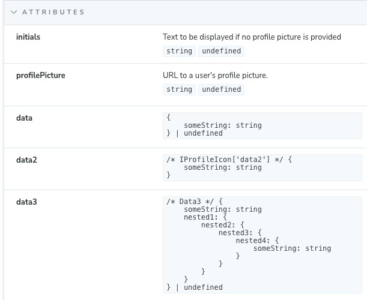

# cem-plugin-complex-types

[](https://github.com/jls-digital/cem-plugin-complex-types/blob/main/LICENSE)
[](https://www.npmjs.com/package/cem-plugin-complex-types)
[](https://packagephobia.com/result?p=cem-plugin-complex-types)

This custom elements manifest analyzer plugin adds support for resolving complex types in custom element properties



## Installation

1. `npm install --save-dev cem-plugin-complex-types`
2. Add `cem-plugin-complex-types` to your cem config
3. Link a css file in your storybook's `preview-head.html`

```ts
// custom-elements-manifest.config.mjs
export default {
  // ...
  plugins: [
    // ...
    cemPluginComplexTypes(['./src/**/*.ts']),
  ],
};
```

```html
// .storybook/preview-head.html
<link rel="stylesheet" href="node_modules/cem-plugin-complex-types/preview-head-fix.css" />
```

## FAQ

(Click on a question to see the answer.)

<details>
<summary><b>Q: Can it handle classes, interfaces, unions as well as primitive types?</b></summary>

A: Yes, the plugin should be able to handle all of these types. It will resolve the type
to its source code and display it in the Storybook addon panel. If the type is a class or interface, it will show the properties and methods of that type. If it's a union type, it will show all possible types in the union.
</details>

## Contributing

We encourage you to contribute to this project! Please check out the
[Contributing guide](CONTRIBUTING.md) for guidelines about how to proceed and
how to set up your dev environment. Join us!

## License

CEM-Plugin-Complex-Types is released under the [MIT License](LICENSE).
